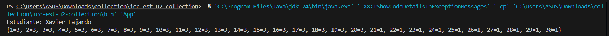
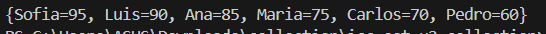

# Práctica: Estructuras No Lineales - 

## Autor
- Nombre: [Xavier Fajardo]
- Carrera/Curso: [Estructura de Datos]

##  Nombre de la práctica - Fecha
- Práctica: [Maps Ejercicisios]
- Fecha: [2026-01-19]

## Descripción
Uso de Maps y for para resolver ejercicios

## Evidencias
### Captura 1
Inserta aquí la captura del código o de la ejecución.
- Archivo: 

### Captura 2 
Inserta aquí una segunda captura si aplica.
- Archivo: 
### Captura 2 
Inserta aquí una segunda captura si aplica.
- Archivo: 